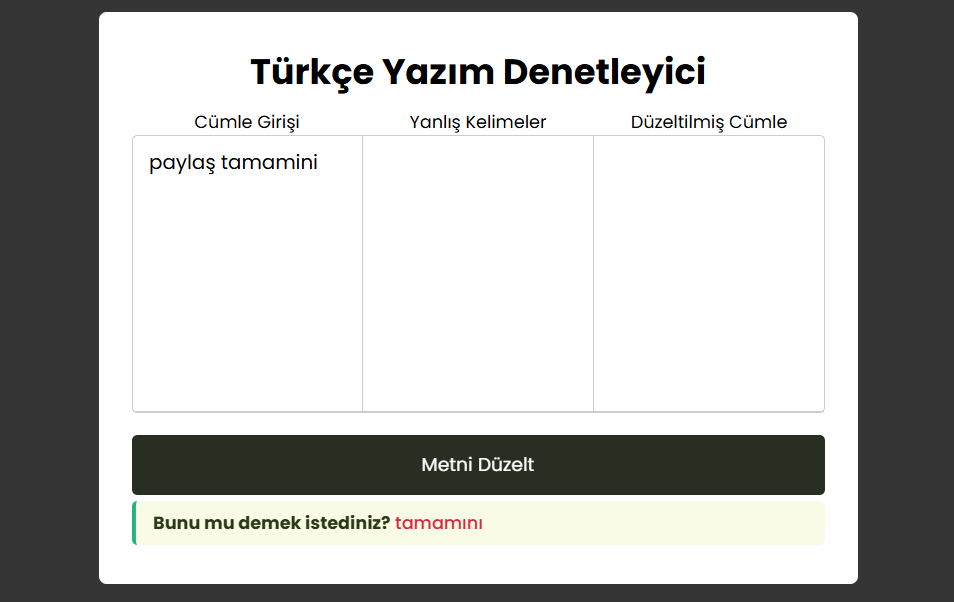
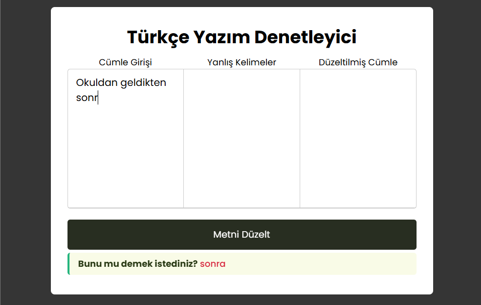
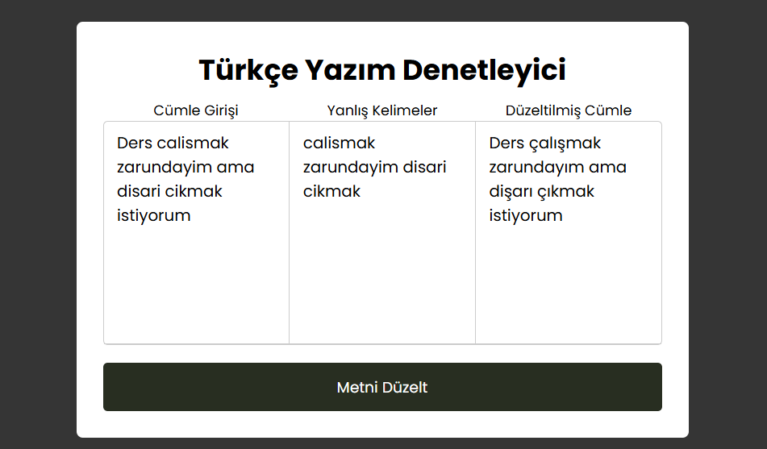

# Türkçe Yazım Düzeltme (NLP)

Bu proje, Türkçe metinlerdeki yazım hatalarını otomatik olarak tespit edip düzelten bir NLP (Doğal Dil İşleme) uygulamasıdır. Derin öğrenme tabanlı bir model (LSTM Seq2Seq) kullanılmıştır.

## Özellikler
- Türkçe cümlelerdeki yazım hatalarını düzeltir.
- Flask ile web arayüzü sunar.
- Model PyTorch ile eğitilmiştir.

## Kurulum
1. Depoyu klonlayın:
   ```bash
   git clone <repo-link>
   cd NLP_YazimDuzeltme_TR
   ```
2. Gerekli kütüphaneleri yükleyin:
   ```bash
   pip install -r requirements.txt
   ```

## Kullanım
1. Uygulamayı başlatın:
   ```bash
   python app.py
   ```
2. Tarayıcınızda `http://localhost:5000` adresine gidin.
3. Metni girin ve düzeltilmiş halini alın.

## Dosya Açıklamaları
- `app.py`: Flask web sunucusu ve ana uygulama dosyası.
- `model/`: Eğitilmiş model ağırlıkları (.pt dosyaları).
- `dataset.csv`: Eğitimde kullanılan veri seti.
- `train.ipynb`: Modelin eğitildiği Jupyter defteri.
- `static/`, `templates/`: Web arayüzü dosyaları.

## Notlar
- Büyük model dosyaları ve test görselleri `.gitignore` ile hariç tutulmuştur.
- Herhangi bir hata veya öneriniz için lütfen issue açın.

## Örnek Test Görselleri
Aşağıda, modelin test edildiği bazı örnek görselleri bulabilirsiniz:

<p align="center">
  
  
  
</p>

---


